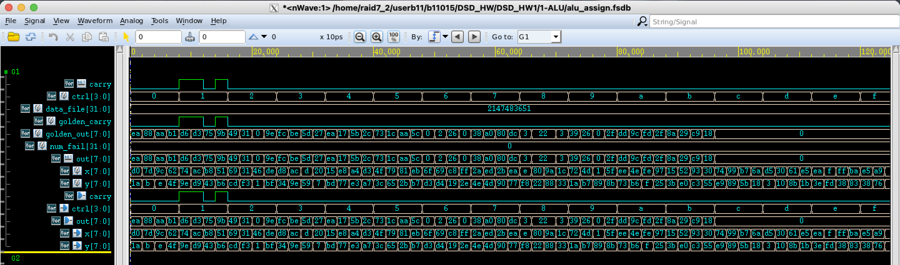
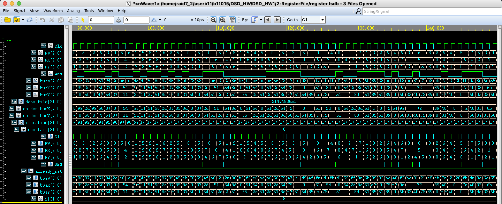

# DSD HW1 Report  

Author: b11901015 黃思維
Date: 2024/03/26  

## 1. ALU  

  
  

## 2. Register File  



## How I Verify Correctness  

Actually I didn't use nWave during my development, since setting up X11 forwording is frustrating and not compatible with my vscode. (Actually It took me extra 1 hour to take these 3 screenshots)  
So, how I verify the correctness of my design? Actually I write reference golden model in python, generate some random testcases, and compare the output of my design with the golden model.  
I have highly confidence to my design, since I have verified it with the golden model with numerous testcases.  

Following is parts of the code:

```python
class RegisterFile:
    def __init__(self):
        self.regfile = [0] + [255]* 7  # 8 registers, each 8-bit wide

    def read(self, rx, ry) -> tuple[int, int]: # bus_x and bus_y
        """Read values from registers RX and RY."""
        return self.regfile[rx], self.regfile[ry]

    def write(self, wen, rw, bus_w):
        """Write value to register RW if write enable (WEN) is set."""
        if wen and rw != 0: # RW0 is hardwired to 0
            self.regfile[rw] = bus_w & 0xFF  # Ensure 8-bit storage

    def step(self, wen, rw, rx, ry, bus_w):
        """Read values from registers RX and RY, then write to register RW."""
        # Write have 1 cycle delay, so read first
        out = self.read(rx, ry)
        self.write(wen, rw, bus_w)
        return out
```

```python
def alu_golden(ctrl, x, y):
    carry = 0
    if ctrl == 0b0000:  # Addition with carry
        result = (x + y) & 0xFF  # Ensure 8-bit result
        carry = ((x + y) >> 8) & 1
    elif ctrl == 0b0001:  # Subtraction with carry
        result = (x - y) & 0xFF
        carry = ((x - y) >> 8) & 1
    elif ctrl == 0b0010:  # Bitwise AND
        result = x & y
    elif ctrl == 0b0011:  # Bitwise OR
        result = x | y
    elif ctrl == 0b0100:  # Bitwise NOT of x
        result = (~x) & 0xFF
    elif ctrl == 0b0101:  # Bitwise XOR
        result = x ^ y
    elif ctrl == 0b0110:  # NOR
        result = (~(x | y)) & 0xFF
    elif ctrl == 0b0111:  # Left shift y by lower 3 bits of x
        result = (y << (x & 0b111)) & 0xFF
    elif ctrl == 0b1000:  # Right shift y by lower 3 bits of x
        result = (y >> (x & 0b111)) & 0xFF
    elif ctrl == 0b1001:  # Arithmetic right shift x
        result = ((x & 0x80) | (x >> 1)) & 0xFF
    elif ctrl == 0b1010:  # Left rotate x
        result = ((x << 1) | ((x >> 7) & 1)) & 0xFF
    elif ctrl == 0b1011:  # Right rotate x
        result = ((x >> 1) | ((x & 1) << 7)) & 0xFF
    elif ctrl == 0b1100:  # Equality comparison
        result = 1 if x == y else 0
    elif ctrl in (0b1101, 0b1110, 0b1111):  # Always 0 for these cases
        result = 0
    else:
        result = 0  # Default case
    
    return carry, result
```

The Following are parts of the testcases:
ALU(OP, X, Y, C, OUT)

```csv
0000 11010000 00011010 0 11101010
0000 01111101 00001011 0 10001000
0000 10011100 00001110 0 10101010
0000 01100010 01001111 0 10110001
0001 01110100 10011110 1 11010110
0001 10101100 11011001 1 11010011
0001 10111000 01000011 0 01110101
0001 01010001 10110110 1 10011011
0010 01101001 11001101 0 01001001
0010 00110001 11110011 0 00110001
0010 01000110 00000001 0 00000000
0010 11011110 10111111 0 10011110
0011 11011000 00110100 0 11111100
0011 10101100 10011110 0 10111110
0011 00001101 01011001 0 01011101
0011 00100000 00000111 0 00100111
0100 00010101 10111101 0 11101010
0100 11101000 01110111 0 00010111
0100 10100100 11100011 0 01011011
0100 11010011 10100111 0 00101100
0101 01001111 00111100 0 01110011
0101 01111001 01100101 0 00011100
0101 10000001 00101011 0 10101010
0101 11101011 10110111 0 01011100
0110 01101111 11010011 0 00000000
0110 01101001 11010100 0 00000010
0110 11001000 00011001 0 00100110
0110 11111111 00101110 0 00000000
0111 00101010 01001110 0 00111000
0111 11101101 01001101 0 10100000
0111 00101011 10010000 0 10000000
0111 11101010 01110111 0 11011100
1000 00001110 11111000 0 00000011
1000 10000000 00100010 0 00100010
1000 10011010 10001000 0 00100010
1000 00011100 00110011 0 00000011
1001 01110010 00011010 0 00111001
1001 01001101 10110111 0 00100110
1001 00000001 10001001 0 00000000
1001 01011111 10001011 0 00101111
1010 11101110 01110011 0 11011101
```

REG(WREN, RW, RX, RY, BUSW, BUSX, BUSY)

```csv
1   0   0 000 00000000 00000000 00000000
1   1   0 000 00000000 00000000 00000000
1  10   0 000 00000000 00000000 00000000
1  11   0 000 00000000 00000000 00000000
1 100   0 000 00000000 00000000 00000000
1 101   0 000 00000000 00000000 00000000
1 110   0 000 00000000 00000000 00000000
1 111   0 000 00000000 00000000 00000000
0  10 111 000 10010011 00000000 00000000
1  11   1 011 01001110 00000000 00000000
0 111 101 110 01011011 00000000 00000000
1  10   1 011 01010010 00000000 01001110
0  10 111 011 00111001 00000000 01001110
0  10 101 111 00000010 00000000 00000000
1  10  10 000 01010001 01010010 00000000
1 111 110 010 10000110 00000000 01010001
1  10  10 011 00100000 01010001 01001110
1   0 100 001 10000101 00000000 00000000
1   0 110 111 11000100 00000000 10000110
1   0 110 000 10100110 00000000 00000000
1   1 101 000 10010111 00000000 00000000
0 101   0 110 00111110 00000000 00000000
1 111 110 100 10111110 00000000 00000000
1  11 100 010 11010011 00000000 00100000
1   0 111 100 10101011 10111110 00000000
0  11   1 101 01111100 10010111 00000000
0 111 110 000 00110001 00000000 00000000
0   1 110 111 11011111 00000000 10111110
1  10 101 010 01010000 00000000 00100000
0   1 110 111 11100111 00000000 10111110
1  10   0 000 00110110 00000000 00000000
0  10  11 001 01000010 11010011 10010111
1 100 110 111 00110010 00000000 10111110
0 111 100 111 00100100 00110010 10111110
0   0 110 101 01110011 00000000 00000000
0 100   0 011 11100101 00000000 11010011
1   1   0 001 01011101 00000000 10010111
1  11 100 011 01010111 00110010 11010011
0   0 101 010 01110101 00000000 00110110
0 100 100 110 10100011 00110010 00000000
0   1   0 001 10100001 00000000 01011101
0 100   1 100 11000001 01011101 00110010
0   1  10 101 00110101 00110110 00000000
1  10 100 011 01011010 00110010 01010111
0  11  10 110 01111111 01011010 00000000
1   1   0 101 10111000 00000000 00000000
```

<div style="page-break-after: always;"></div>

## What I have found

never trust copilot.  
I spend 2 hours on debugging the Register.  
When I finally found the bug, It was actually in simple_calculator.v.  
Copilot connect these signals in an atrocious way. Actually, I manually corrected 6 signals before passing the test.  
The folk is right, "LLM won't make software engineer umemployed, but will create more jobs for debugging LLM generated code."  

A small complaint:  
REGISTER FILE SHOULD HAVE A RESET SIGNAL!!!!!!!!  
Since the testbench is given and doesn't manually reset the register file, I have to use some weird tricks to reset the register file.  